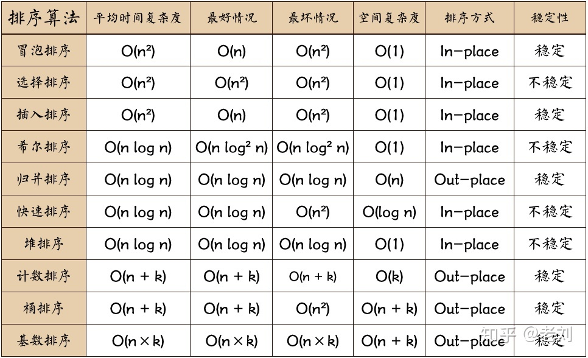
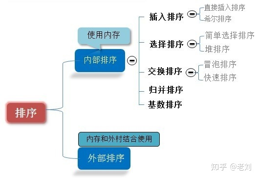
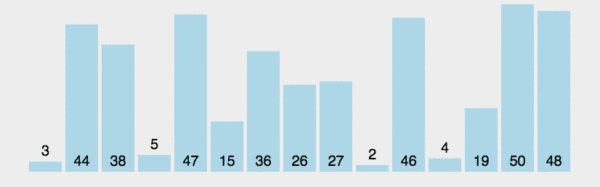
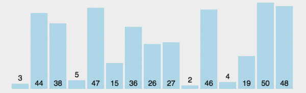
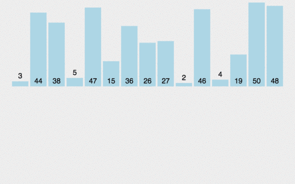

## 0 排序算法说明 

### 0.1 术语说明
* 稳定：如果a原本在b前面，而a=b，排序之后a仍然在b的前面；
* 不稳定：如果a原本在b的前面，而a=b，排序之后a可能会出现在b的后面；
* 内排序：所有排序操作都在内存中完成；
* 外排序：由于数据太大，因此把数据放在磁盘中，而排序通过磁盘和内存的数据传输才能进行；
* 时间复杂度： 一个算法执行所耗费的时间。空间复杂度：运行完一个程序所需内存的大小。

### 0.2 算法总结


##### 图中名词解释
* n: 数据规模
* k: “桶”的个数
* In-place: 占用常数内存，不占用额外内存
* Out-place: 占用额外内存

### 0.3 算法分类



### 0.4 比较和非比较的区别

常见的快速排序、归并排序、堆排序、冒泡排序等属于比较排序。在排序的最终结果里，元素之间的次序依赖于它们之间的比较。每个数都必须和其他数进行比较，才能确定自己的位置。

在冒泡排序之类的排序中，问题规模为n，又因为需要比较n次，所以平均时间复杂度为O(n²)。在归并排序、快速排序之类的排序中，问题规模通过分治法消减为logN次，所以时间复杂度平均O(nlogn)。

比较排序的优势是，适用于各种规模的数据，也不在乎数据的分布，都能进行排序。可以说，比较排序适用于一切需要排序的情况。

计数排序、基数排序、桶排序则属于非比较排序。非比较排序是通过确定每个元素之前，应该有多少个元素来排序。针对数组arr，计算arr[i]之前有多少个元素，则唯一确定了arr[i]在排序后数组中的位置。非比较排序只要确定每个元素之前的已有的元素个数即可，所有一次遍历即可解决。算法时间复杂度O(n)。

非比较排序时间复杂度低，但由于非比较排序需要占用空间来确定唯一位置。所以对数据规模和数据分布有一定的要求。

## 1 冒泡排序 （Bubble Sort） 

冒泡排序是一种简单的排序算法。它重复地走访过要排序的数列，一次比较两个元素，如果它们的顺序错误就把它们交换过来。走访数列的工作是重复地进行直到没有再需要交换，也就是说该数列已经排序完成。这个算法的名字由来是因为越小的元素会经由交换慢慢“浮”到数列的顶端。

### 1.1 算法描述

* 比较相邻的元素。如果第一个比第二个大，就交换它们两个；
* 对每一对相邻元素作同样的工作，从开始第一对到结尾的最后一对，这样在最后的元素应该会是最大的数；
* 针对所有的元素重复以上的步骤，除了最后一个；
* 重复步骤1~3，直到排序完成。

### 1.2 动图演示



### 1.3 代码实现 

Java:
```
public static int[] bubbleSort(int[] array) {
        if (array.length == 0)
            return array;
        for (int i = 0; i < array.length; i++)
            for (int j = 0; j < array.length - 1 - i; j++)
                if (array[j + 1] < array[j]) {
                    int temp = array[j + 1];
                    array[j + 1] = array[j];
                    array[j] = temp;
                }
        return array;
    }
```

### 1.4 算法分析

最佳情况：T(n) = O(n) 最差情况：T(n) = O(n2) 平均情况：T(n) = O(n2)


## 2 选择排序 （Selection Sort）

表现最稳定的排序算法之一，因为无论什么数据进去都是O(n2)的时间复杂度，所以用到它的时候，数据规模越小越好。唯一的好处可能就是不占用额外的内存空间了吧。理论上讲，选择排序可能也是平时排序一般人想到的最多的排序方法了吧。

选择排序(Selection-sort)是一种简单直观的排序算法。它的工作原理：首先在未排序序列中找到最小（大）元素，存放到排序序列的起始位置，然后，再从剩余未排序元素中继续寻找最小（大）元素，然后放到已排序序列的末尾。以此类推，直到所有元素均排序完毕。

### 2.1 算法描述

n个记录的直接选择排序可经过n-1趟直接选择排序得到有序结果。具体算法描述如下：
* 初始状态：无序区为R[1..n]，有序区为空；
* 第i趟排序(i=1,2,3…n-1)开始时，当前有序区和无序区分别为R[1..i-1]和R(i..n）。该趟排序从当前无序区中-选出关键字最小的记录 R[k]，将它与无序区的第1个记录R交换，使R[1..i]和R[i+1..n)分别变为记录个数增加1个的新有序区和记录个数减少1个的新无序区；
* n-1趟结束，数组有序化了。

### 2.2 动图演示



### 2.3 代码实现

Java

```
public static int[] selectionSort(int[] array) {
        if (array.length == 0)
            return array;
        for (int i = 0; i < array.length; i++) {
            int minIndex = i;
            for (int j = i; j < array.length; j++) {
                if (array[j] < array[minIndex]) //找到最小的数
                    minIndex = j; //将最小数的索引保存
            }
            int temp = array[minIndex];
            array[minIndex] = array[i];
            array[i] = temp;
        }
        return array;
    }
```

### 2.4 算法分析

最佳情况：T(n) = O(n2) 最差情况：T(n) = O(n2) 平均情况：T(n) = O(n2)

## 3 插入排序 （Insertion Sort）

插入排序（Insertion-Sort）的算法描述是一种简单直观的排序算法。它的工作原理是通过构建有序序列，对于未排序数据，在已排序序列中从后向前扫描，找到相应位置并插入。插入排序在实现上，通常采用in-place排序（即只需用到O(1)的额外空间的排序），因而在从后向前扫描过程中，需要反复把已排序元素逐步向后挪位，为最新元素提供插入空间。

### 3.1 算法描述

一般来说，插入排序都采用in-place在数组上实现。具体算法描述如下：
* 从第一个元素开始，该元素可以认为已经被排序；
* 取出下一个元素，在已经排序的元素序列中从后向前扫描；
* 如果该元素（已排序）大于新元素，将该元素移到下一位置；
* 重复步骤3，直到找到已排序的元素小于或者等于新元素的位置；
* 将新元素插入到该位置后；
* 重复步骤2~5。

### 3.2 动图演示



### 3.3 代码实现

```
public static int[] insertionSort(int[] array) {
        if (array.length == 0)
            return array;
        int current;
        for (int i = 0; i < array.length - 1; i++) {
            current = array[i + 1];
            int preIndex = i;
            while (preIndex >= 0 && current < array[preIndex]) {
                array[preIndex + 1] = array[preIndex];
                preIndex--;
            }
            array[preIndex + 1] = current;
        }
        return array;
    }
```

### 3.4 算法分析

最佳情况：T(n) = O(n) 最坏情况：T(n) = O(n2) 平均情况：T(n) = O(n2)

### 4 希尔排序 （Shell Sort）

希尔排序是希尔（Donald Shell）于1959年提出的一种排序算法。希尔排序也是一种插入排序，它是简单插入排序经过改进之后的一个更高效的版本，也称为缩小增量排序，同时该算法是冲破O(n2）的第一批算法之一。它与插入排序的不同之处在于，它会优先比较距离较远的元素。希尔排序又叫缩小增量排序。

作者：老刘
链接：https://www.zhihu.com/question/23148377/answer/718815659
来源：知乎
著作权归作者所有。商业转载请联系作者获得授权，非商业转载请注明出处。