## 1. Pay Attention! 
注意力集中。有意识的让自己集中精力，不吃东西，不发短信，不做任何让你感觉分散精力的事情。
必须要让自己意识到，绝大多数人的日常生活中，开车是最危险的事情，为了自己和家人，你必须得全神贯注。

## 2. Don't Trust Nobody!

不要相信别人。打转向灯不代表他就要转向，可能是他忘了关了，也可能他的转向灯早就坏了。
红灯了不代表他一定会停，他可能喝多了，也可能走神了。总之，不要把自己的幸福交到别人手上，一定要做好准备，不要默认别人都是好司机。

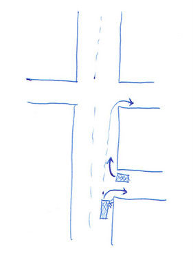

比如你在路口等着右转，这时候来了一个打着右转向灯的车，千万不要直接冲出去，因为这个车可能在这个路口右转，也可能在下一个路口右转，也可能只是打错了转向灯，所以一定要看好再走。同样，如果你要右转，一定要在合适的时机打转向灯，不要太早，也不要太晚，不要让别人产生误解。

## 3. Yield Anyway!

如果你拿不准应该谁yield谁，那就宁愿多等一会儿，让对方先走。也许对方违反交规，也许按照交规应该你先走，但是我们不是在谈论交规，我们是在谈论安全驾驶。不要把自己的安全寄托到打赌对方理解并且遵守交规上。

## 4. Don't speed!

不要超速。你的反应时间是固定的，超速会让你的车在反应时间内多走更多的距离，这还没有算超速导致的刹车距离的增加。同时，超速导致一旦撞击发生，碰撞需要耗散的动能更大，伤害也就更大。而且，超速并不会让你更快，限速40的城市道路，如果你开40，基本上会一路绿灯，因为信号灯系统就是按照限速匹配的。如果你开60，结果就是你会在下一个路口遇到红灯，根本不会更快。即使是50英里路程的高速路，你超速开80，和你按限速开65，实际的差距可能也就七八分钟，你真的愿意为了这七八分钟承担那么高的安全风险吗？

## 5. Don't Drive Impaired.

不要喝酒，不要吃对驾驶有影响的药物。如果喝酒或者吃药了，就不要开车了。上车前问自己，自己是不是对家人负责？是不是对别人负责？

## 6. Wear your seat belt!

永远系安全带。安全带是最伟大的汽车安全方面的发明，除了可以提供撞击保护、吸收撞击能量、保护你不被甩出车辆之外，安全带还可以确保你的身体在现代汽车的「溃缩区域」之外。也许你不希望在意外比如火灾发生的时候被困在车内，但是那样的案例几乎从未发生过。更多的案例是没有系安全带，因为撞击而昏迷，丧失了逃生的行动能力。

## 7. Buy and use safety devices.

购买儿童座椅，尽量选购有 ABS、ESP、气囊以及主动刹车、车辆偏离预警、后视镜盲点示警等安全措施的车辆。

## 8. Motorcyclist—Protect Thyself!

驾驶摩托车一定要戴头盔。汽车之间 fender bender 这样的小擦碰，对于摩托车来说可能就是致命的。失去平衡之后摩托车手可能会被甩出，然后身体撞击到路面、其它车辆、石头、大树等等，继而造成严重的伤害。如果驾驶摩托车，除了质量合格的头盔之外，安全眼镜、机车服、护膝、靴子…一样都不能少。

## 9. Don't Run Red!

不要闯红灯。闯红灯有两种，一种是走神根本没看到红灯，另一种是看到已经要变红灯了还加大油门抢红灯。 the green light anticipator met the red light procrastinator  这个方向在变绿的一瞬间就加速冲出去，跟另一个方向在红灯已经亮起之后依然踩油门抢红灯的相遇，这是非常典型的车祸类型，而且撞击一般都是 T 字形，由于是侧面撞击，通常会造成更严重的伤害。

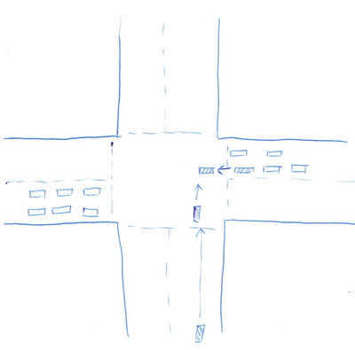

万不要一变绿就窜出去，也不要猛加速抢最后的绿灯。

## 10. Drive Precisely!

严格按照交规驾驶。严格遵守 No U-Turns、No right turn on red 这些路牌，每一次需要打转向灯的时候都打转向灯，stop sign 前面真的彻底停车……每个人都遵纪守法，交通安全才有保证。

## 11. Chill Out!

不要被坏情绪影响，提醒自己安全最重要，其它的都可以放一放。不要跟二逼司机斗气，十分钟后，你就会忘了这事。很多事故都是因为至少一方的司机生气、沮丧、分神、心情低落造成的。

## 12. Look Down the Road!

尽量放远自己的视野，越远越好，至少可以保证看到 15-20 秒之后才会到达的地方。注意前方的障碍物、施工、卡车、违章车辆、行人、动物，越早注意到就越有时间做好准备。另外，自己的视野不要聚焦在某一个地方超过一秒以上，不要盯着路边的广告牌、行人之类的一直看。

## 13. Create Space: Use the "Two-Second-Plus Rule" 

保持车距，至少应该保持 2 秒钟的距离。在前车通过一个固定标志物的时候开始计时，到自己通过这个标志物，之间的时间应该至少 2 秒钟。夜间、雨雪、路面湿滑的情况下要增大到 4 到 6 秒，如果路面结冰建议保证 8 到 10 秒左右。计时可以用默念 "one-thousand-one, one thousand two" 的方法，念到 two 刚好是两秒左右。不要担心车距太大有人会插进来，It doesn't matter， 根本就不会耽误你的时间，重要的是自己的安全。同时注意相邻车道的情况，不要并驾齐驱，也不要行驶在相邻车道的车辆的盲区里。停车等红灯的时候也不要跟前车太近，要留出足够的空间，至少要让自己能看到前车的后轮轮胎，这样一旦有意外发生，你可以有紧急向前避让或者向两侧避让的余地。

## 14. Drive to Communicate

合理的向其他司机表明你的意图。永远不要忘了打转向灯；视线不好的时候要开车灯，让别人知道这里有车；用刹车灯来告诉后车我在减速，不要为了省油或者其它原因而不踩刹车，至少要踩一两下刹车，通过刹车灯的闪烁告诉后车你在减速。

## 15: Drive Predictably

了解路况，对路程预先了解，不要在高速路出口之前一点点的地方为了下高速连变五个车道。如果不熟悉路，错过了高速出口，不要尝试急变道、急刹车等等，应该到下一个出口下来再反向回来。绝大多数高速都有下来再反向回来的通道，耽误不了多长时间。如果在市区找路，不要突然停车或者突然转向，最好到附近的停车场停车，看好路之后再走。

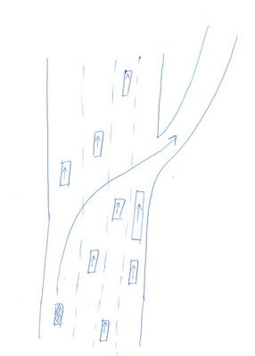

提前看好路，不要这样下高速。
不要走神，看好路标和路牌，提前准备，一道一道的变过去，不要到最后一刻强行连变好几个车道。

## 16. Always Signal Your Intentions 

永远记得打转向灯。注意完成转弯之后要及时取消转向灯，特别是一些卡车或者货车。此外，要注意打信号的时间，比如前面是十字路口，你要直行过去十字路口之后再右转进路边的加油站，这时候过十字路口之前就不要打信号，避免别人误解你是要在十字路口右转。

## 17. Know Your Blind Spots!

注意盲区。每隔 5-8 秒检查一下后视镜，随时掌握前后左右的情况。变道的时候一定要 shoulder check，回头检查盲区。倒车的时候要回头，注意盲区里的行人、小朋友或者小动物。不要行驶在大货车、大客车的盲区里。

## 18. Avoid Distractions!

不要分神，安全驾驶永远是第一位的。调音乐、接电话、吃东西、化妆…这些都可以放一放，没有什么是一定要在开车的时候做的。

## 19. Avoid Backing Up!

尽量避免倒车。倒车的时候一定要回头。大量的小擦碰都是在倒车的时候发生的，在停车场停车的时候，如果可能的话，尽量找一个对面也没有车的车位，这样正着进去，然后开到对面车位停下，走的时候正着出来。尽量避免在马路上倒车，如果越过了红灯线或者 stop 线，在不妨碍别人的情况下，尽量不要倒回去，可以原地等待下一个信号。

## 20. Beware of Intersections!

市区内大多数的事故都是在路口发生的，通过路口的时候一定要多加小心。尽量要减速通过，尤其是当你看不到另一个方向的情况的时候。很多事故发生在绿灯变红灯后、或者红灯变绿灯后的4秒之内，尽量避免自己在那4秒的时候位于路口中央。如果你怕后面的人不耐烦，可以在红灯停车的时候停的靠后一些，让自己跟停车线之间留一段距离，变绿后松开刹车，等到确认另一个方向没有闯红灯的车辆、或者还在过马路的行人，这之后再踩油门。这样后面的人知道你看到了信号灯，刹车灯灭了，你的车也动了，也就不会觉得你在故意挡路。

## 21. Be a Freeway Pro!

永远不要在高速上停车。如果看到路边紧急停车的车辆，尽量向左变道，空出足够的安全距离，不要高速擦过路边停着的故障车辆，因为万一有人突然从车旁边出现、或者车门突然打开，后果都会很严重。在上高速前的匝道上加速到足够快的速度，不要在匝道与高速交汇的地方减速甚至停车等待变道的机会。如果你的速度已经提高到了跟高速车流匹配的速度，你有足够的时间和机会向左变道。不要压白色斜线标出来的缓冲区域。如果有救护车或者警车，向右变道，让出左道，不要不知所措，不要停车。控制自己的车速跟上车流的速度，过快或者过慢都很危险。很久以前，大家在变道超车之前会鸣笛闪灯示意，但是现在没有人这么做了，如果你这么做会被当作挑衅。打好转向灯就好了，注意周围车道的情况，不要第一道和第三道的车同时并到第二道上。

## 22. Know How to Stop! stop sign

前面一定要停车，一定要彻底停车，然后看清楚周围的情况，在确定绝对安全之后，再起步。不要以低速溜到stop sign 前面然后接着加速通过，每个 stop sign 都是有原因的，一定要看清楚情况之后再走。绝大多数事故总是至少有一方没有看清楚就加速起步了。

## 23. Know When to Use Your Headlights! 

夜晚、雨雪、雾天、黎明黄昏等等记得开灯。如果你需要持续用雨刷，那么你就应该开灯了。不要 out-driving your headlights，自己的反应时间、制动距离加起来，要低于车灯照亮的范围。不要车速过快，这样一旦灯光照到障碍物，你已经来不及了。确保自己的大灯工作正常，定期清洁灯罩。如果对面的大灯太亮，试着向右边看，用右边的马路边缘白线确定方向，用左边眼角的余光观察对面车道的情况。

## 24. Slow Down in Rain and Snow!

雨雪天气要减速。最湿滑的时候是刚刚开始下雨的半个小时，路面的油渍被雨水冲开，浮成一层，车辆抓地力严重降低。半小时以后，雨水会把油渍冲走，情况会稍有好转。一般来说，下雨天要减速三分之一，雪天要减速一半以上。

## 25. Maintain Your Vehicle's Tires

保持良好的轮胎状况，再好的车也是靠轮胎提供抓地力。用1美分的硬币测试，如果硬币插进纹路里，林肯的头都露在外面，那就说明该换胎了。保持合理的胎压。

## 26. Take Care of Your Vehicle

保养车辆，不要在刹车或者轮胎上省钱。定期检查机油、刹车油、冷却液等等。

## 27. Get Rid of Tailgaters

不要紧紧跟着别的车。如果有车紧紧跟着你，尽量缓慢的减速，增大你自己与前车的车距，这样把你自己和后面紧跟着你的那个二逼的反应余地都留出来。可能的情况下，变道甚至靠边停车让这个二逼先过去，千万不要跟二逼斗气，不要试图靠轻点刹车让他远离你，更不要急刹车。他都二逼成这样了，千万不要跟他纠缠。

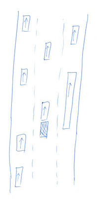

不要当 tailgater，不要紧跟着前面的车。

## 28. Maintain an Even, Measured Pace

不要当人人讨厌的 jackrabbit，不要左窜右突，不要来回变道，不要急加速急减速。这些 jackrabbit 之所以要变道超车，是因为他们的车速太快了。尽量不要变道，变道超车并不会节省多少时间，反而会大大增加事故的可能性。如果有人要在你前面并线，稍微减速让他并进来。相信我，十次有九次，你会跟 jackrabbit 几乎同时到达目的地，来回变道的鲁莽驾驶根本不会节省时间。

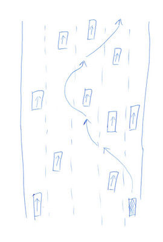

不要当这样的 jackrabbit。

## 29. Check for Hydroplaning!

避免雨天打滑。雨天尽量减速，尽量避免驶进大水坑，尽量避免过快的速度过弯。如果你在后视镜里能观察到路面上自己的车辙轮胎印，说明轮胎排水良好；否则的话，你就可能有打滑的危险。为了避免打滑，应该换胎，雨天要降低车速，试着沿着前车的轮胎印行驶。一旦打滑不要惊慌，松开油门，不要刹车，不要急打方向，避免任何剧烈操作，平缓的让车辆速度降低，重新获得抓地力。

## 30. Know How To Recover from a Skid

第一步是要尽量避免打滑。一旦打滑发生，不要惊慌。最最常见的家用前驱车一般会转向不足，这时候不要剧烈操作，应该轻轻的减小转向幅度，尽量减速但是不要急刹车，速度下来之后轮胎重新获得抓地力这时候你就又有了方向的控制。如果是后驱车的转向过度，或者是四驱车的失控，情况要更复杂一些。有条件的话可以去高级驾驶培训，在专业人士的指导、安全可控的条件下练习如何控制侧滑和漂移。

## 31. Avoid Head-On Collisions

对头相撞是最糟糕的事故，一定要尽量避免。不良天气要开大灯，提醒其它司机自己的位置。山区弯路不要切中央黄线，更不要越过黄线。注意对面车道的情况，提前发现异常情况。紧急时刻一定要做出正确的选择，尽量减速，向右避让，哪怕侧面撞到右边的其它障碍物，也不要向左迎头相撞。

## 32. Be a Safe Passer

安全超车。首先，思考有没有必要超车。如果你需要猛踩油门才能完成超车，那说明你根本没有超车的必要。如果确定要超车，一定要确认超车道的前方有足够的距离，不要变到超车道却发现前面还有别的车辆。超车前不要 tailgate，不要直逼到前车的车尾再突然变道，超车的时候不要超速，超车之后跟被超的车有足够的距离之后再回到本来的车道。如果距离不够，后车需要刹车避让你，即使不需要刹车，你高速变道蹦起的小石子也会打到后车的挡风玻璃上。最后，不要在视野不好的山路、桥梁、十字路口、学校附近的禁止超车区尝试超车。

## 33. Avoid the Single-Vehicle ollision

避免单车失控的事故。最常见的情况是走神或者打盹，车辆偏离方向，一般是偏向右侧，在轧到沙土或者路肩之后车辆开始颠簸，司机惊醒，然后在惊慌失措的情况下反应过度，猛踩刹车或者猛打方向，导致彻底失控。永远保持注意力集中，不喝酒，不打盹，永远系安全带。

## 34. Deal with Light Glare

注意远光灯，不要用远光灯直射对面车道。很多警察在高速上专门抓这个。被强光耀眼之后视觉恢复的能力随着年龄的增长而减退，所以应该保持合理的夜晚速度，不要过快。被别人的灯光耀眼之后，试着把视线扭向右边，靠右侧车道白线导引方向，用左眼余光注意对面车道，防止第31条的对头相撞。

## 35. Never Play Chicken with a Train!

永远不要跟火车抢路，永远不要在铁路路口玩火。通过铁路路口最好等前车完全通过之后你再出发，防止前车刚过去铁路就抛锚，你被前后车刚好逼停在铁路上。

## 36. Beware of Stopped or Slow-Moving Vehicles 

注意停在路边的车辆，注意低速行驶的车辆。停在路边的车辆可能是在修车，也可能有别的原因，不要高速擦过，万一有人突然从车后面出来，根本反应不及。设身处地，如果你的车坏了，你等在路边，尝试修车，你肯定不希望路上的车飞速掠过你和你的车。同样，有车行驶的很慢，不要鲁莽的超过去，一定要先搞清楚原因。前车开的慢，可能是前面有行人，或者有小动物，或者有自行车，你看都不看，高速超过前车，很可能会跟行人或者小动物发生碰撞。尤其是路口，最右道的车停车或者减速，很可能是因为有行人要过马路，你在左道不要不减速，一定要看清楚有没有被前车挡住的视觉死角里有没有行人之后再通过。

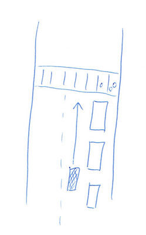

右道的车在等行人，左道前面没车，千万不要高速通过，一定要减速，注意视觉盲区里的行人。

## 37. Practice Animal Avoidance!

在乡间高速或者普通公路上，与野生动物的碰撞也是很高发的事故类型。尽量避免撞击野生动物，注意路边野生动物出没的标志，适当减速，尤其是夜间或者视线不好的时候。如果鹿、野牛之类的大型动物在路中央，不要鸣笛，因为可能会激怒他们，耐心的等待他们过马路。如果他们一直不走，在确定安全的前提下，可以非常慢的绕过他们。在车辆稀少、有动物出没的区域，可以考虑用远光灯提醒动物。如果有发生碰撞的可能性，不要猛烈转向，因为动物可能也会转向相同的方向，还可能会让车辆失控，要尽量用减速来降低撞击力。万一发生了碰撞，不要下车接近动物，因为大型动物可能会挣扎，让你受伤。

## 38. Don't Prevent Others from Passing

不要阻挡别人超车。如果有人要超车，让他们超。千万不要在后车变道之后你也提速。别人可能有急事，可能是去医院。你阻挡别人超车，对你有什么好处吗？对方肯定不高兴，继而会斗气，不会有任何好结果。

## 39. Drive Your Van Safely

安全驾驶厢式货车、大型SUV、皮卡这些大型车辆。注意增大的视觉盲区，尤其是没有中央后视镜的厢式货车，倒车的时候尽量有人在车外指挥。与前车保持更大的安全车距，因为车重的增加导致停车距离大幅增加。注意侧翻的危险，因为车重和车高，如果速度太快，一点点小的外界因素就会触发侧翻。

## 40. Practice Smart Bicycling

安全使用自行车出行。保护头部，永远戴头盔。夜间或者视线不好的时候一定要确保自己的可视性，安装车灯、反光片，穿反光背心或者衣服，最好使用闪烁的车灯。注意道路情况，不要走神。当车道太窄，已经不足以让汽车安全超过自行车的时候，自行车可以使用整条车道。骑自行车的时候注意路边停着的车，防止突然开门或者突然探头。

## 41. Share the Road With Bicyclists

注意自行车。如果你汇入主干道的时候，不要只看左边没车了就走，一定要检查右边有没有逆向行驶的自行车。stop sign 通行、yield 的顺序自行车享有同样的权利。超自行车的时候一定要留足安全距离，至少大于 5 英尺，如果你开的是SUV或者皮卡，安全距离要更大。如果没有这样的安全距离，不要超车，跟在自行车后面直到路面变宽可以安全超越为止。

## 42. Exercise Prudent Courtesy

保持礼貌，但是也要注意安全。三车道变两车道的时候，保持礼貌，一边一辆交替通行，不要抢路。等红灯的时候路边有车想汇入，可以空出距离让他进来。等红灯或者堵车的时候不要停在路口范围内，给对面车道左转的车辆留出通道。但是注意，堵车或者等红灯的时候，如果你在左道，对面车道想左转，你礼貌的停车让他左转，但是一定要注意你的右道有没有车疾驰而来。万一对面车道开始左转，结果右道冲过来一辆车，双方都看不到对方，非常危险。

防止这样的事故，左道堵车，所以礼貌的让对向的车左转，但是右道还有车疾驰而来。

##43. Recognize the Futility of Rushing

开车的时候着急是无用的。最好的方法是早出发，而不是在路上抢时间。普通的交通事故都是民事案件，但是因为主观赶时间造成的 aggressive driving 在很多州都是刑事案件，即使没有造成什么后果，一样要负法律责任。不要疯狂变道，不要别其他车，不要顶着别人车的尾巴开，不要疯狂加速疯狂减速。

##44. Make Allowances for Your Physical Limitations 

正视自己的身体状况。不要逞强，不要鲁莽，困了就不开车，病了就先歇着，视力不好就戴眼镜，感觉不舒服赶紧在安全的前提下到路边停车场停下。

## 45. Start Rested -- Keep Fresh!

保持清醒。尤其是长途旅行，计划好时间，留足充分的休息时间，出发前就要休息好，吃好喝好。长途旅行要定期去加油站停车休息，呼吸新鲜空气，下车活动活动。

## 46. Share the Road With Trucks

给卡车留出足够的空间，不要超过卡车之后立即变道别卡车，也不要紧跟卡车。卡车的转弯半径非常大，而且转弯的时候有很大的视觉盲区，再加上内轮差的存在，所以一定要注意卡车的转向信号，如果卡车向左偏，可能是卡车想向右拐一个大弯，不要想当然的认为卡车要左转，然后一脚油门想从右边超过卡车，非常危险。对出入口倒车、转向的卡车要有耐心，大型卡车一般要调整若干次才能完成倒车转向，不要紧跟着卡车或者试图绕行超车，结果把局面搞得更糟，大家都卡死在一起。

## 47. Make Space for Parked Vehicles on a Roadway

给路边紧急停靠的车辆留出足够的空间，不要高速擦过他们。

## 48. Give Way on Mountain Roads

山路一定要多小心。对于陡峭的山路上行动缓慢的拖车、卡车要有耐心，不要在视线不好、狭窄的山路上试图超车。如果你是开拖车或者卡车的人，后面积压了四五辆车的时候，你就应该考虑在安全的地方靠边停车，让后面的车先走。

## 49. Make Safe and Sane Left Turns

确保对面车道没车之后再左转，一定要真正确保，不要想当然，不要打赌。如果天气不好视野受限、或者对面车道是弯道或者盲坡，千万不要打赌弯道坡道那边没有车疾驰而来，不要盲目的左转。宁可多等一等，有信号灯的可以等下一个左转信号，没有信号灯也要耐心，看好之后再走，实在觉得危险可以绕道，用三个右转代替这个左转。等待左转的时候先不要让车轮转向，什么时候开始走什么时候再打方向盘，否则万一被后车追尾，如果轮子已经转向，很容易冲到对面车道。

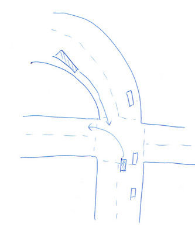

不要盲目的左转，看不清对面的情况不要打赌对面没车。

## 50. Connect Your Mind To Your Eyes!

保持眼睛和大脑的协同工作，不要走神，看到什么情况，立刻用大脑分析，不要视如无物、心不在焉。有意识的训练自己的眼睛注意盲区、交通信号灯等。

## 51. Make Defensive Stops!

不要在变红灯的时候猛刹车，很容易会被后车追尾。先确保自己不超速，然后注意人行道的信号灯，如果人行信号已经变红，说明车行信号马上也要变，这时候就要准备减速，不要在马上要闯红灯的时候再急刹车。不要冲过停车线，更不要停在人行斑马线上，最好让自己车头跟停车线之间留一些距离，这样万一有紧急情况，还有一定的避让余地，不至于一下子就冲到路口中央。

## 52. Slow Down When Approaching Intersections!

你不能确保没有二逼闯红灯。过路口的时候降低速度，保持警惕。有很多安全驾驶教练建议松开油门，把脚悬在刹车踏板上，注意观察另一个方向的情况，时刻准备减速避让。

## 53. Beware of Traffic Holes! 

堵车的时候一定要注意 traffic holes。比如双车道，左道已经堵车堵了好长距离，右道还没有堵，这时候你在右道千万不要大脚油门，因为在左道拥堵的车辆里随时可能会有人突然想变到右道、或者突然有行人、自行车从左道的车缝里钻出来、或者突然有对面方向想左转的车在两车的前后空隙里钻过来。

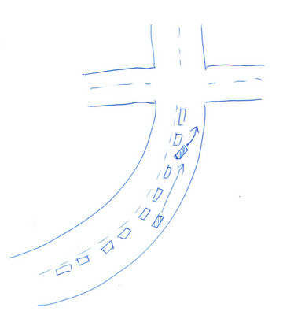

注意这种在排队的车流里突然探头变道的。

## 54: Turn Right, LOOK Right!

右转之前不要光看左边有没有车，也要记得看一下右边有没有行人、自行车，因为行人、自行车可以在路左边靠左走。通过人行横道线的时候永远要看左右两边。

## 55. Avoid Changing Lanes in Intersections

路口附近不要变道。很多车为了抢绿灯，通过路口的速度都非常快，而且路口的车流复杂，不要尝试在路口附近变道，非常危险，你永远不知道旁边车道有没有以55的速度抢绿灯的车、或者对面车道有人在发短信或者走神。如果错过了路口，不要着急，在安全通过路口之后再变道，然后绕行。

## 56. Don't Abuse the Two-Way Left Turn Lane

不要滥用中央双向左转车道。只有到马上要左转的时候再变到这个车道，不要为了超过直行道上的缓慢车流而早早的就开到左转道上，更不要用这个车道来超车。注意对面方向的左转车辆，不要斗气，这本来就是“双向”左转车道。要礼貌避让。很多人把这个双向左转车道叫做“自杀车道”，一定要加倍小心。

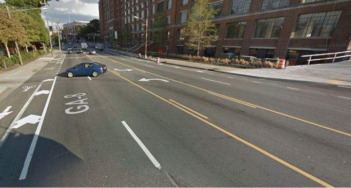

不要用这样的双向左转车道超车，否则很容易迎头撞上对面要左转的车辆。

## 57. Avoid "Reverse Traffic" Lanes

尽量避免使用中央预留车道。很多城市拥堵地区的中央车道是预留给高峰时段的，随着上下班高峰而变更方向，比如早晨上班是南向北的车道，晚上下班变成北向南的车道。尽量避免这些车道，因为这些车道一般都很窄，而且是定时开放、定时变更方向，还经常会跟左转车道冲突。试想这个车道早晨7点变更通行方向，但是你的手表是7点1分，对面司机的手表是6点58…

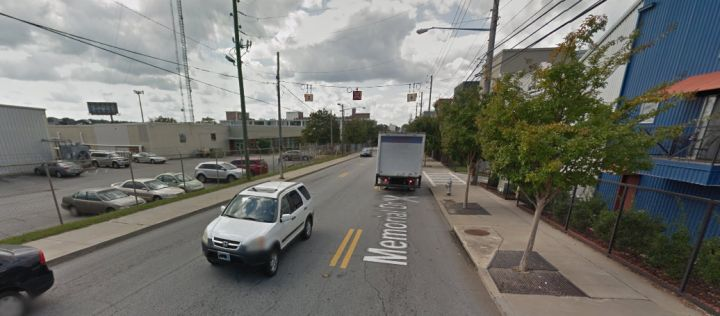

尽量不在图中这种定时变换行车方向的中央车道行驶。

## 58. Move Right When Approaching Intersections

在通过路口的时候偏向车道的右侧，尤其是开摩托车的时候。要让对面方向等待左转的车辆尽早看到你，不要紧贴着自己方向等待左转的车流冲过去，否则对面想左转的车辆看不到你，就会冒险左转。

## 59. Beware of Stopped Vehicles at Crosswalks

注意人行横道线。如果前面的斑马线前面有车停住，你也一定要减速，准备好停车。千万不要高速超过这个停着的车，因为很可能斑马线上有行人，很可能行人走过那个停着的车继续过马路，结果你高速驶来，避让不及。学校附近不要超车，万一你提速超车之后发现车道前方有小朋友，很可能就避让不及。同样，千万不要超过停着的正在接送学生的校车，不仅不合法，而且非常危险。

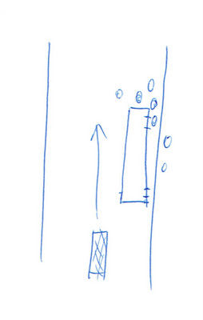

不要超越路边停着接送学生的校车，小朋友下车后可能直接在校车前面过马路。

## 60. Use the Center Lane for Safety

高速上尽量选择中央车道。右侧车道变道频繁，上匝道下匝道附近车流交汇。左侧车道车速都较快，很多 jackrabbit 喜欢在左道疯狂超车。尽量选择中间的车道，维持合理车速。不要与附近车道并驾齐驱，更不要被左右车道的车辆同时夹在中间。

## 61. Never Stop on a Freeway!

除了紧急情况，永远不要在高速路停车。走错路、看地图、换音乐、换司机、看风景，这些都不是紧急情况，不要玩火。

## 62. Don't Cross a Freeway Median!

不要在高速上掉头。高速的中央通道或者中央缓冲地带是给道路维修和应急车辆准备的。掉头后你会直接汇入对面方向最左道的开的最快的车流，非常危险。

## 63. Seat Belts and Air Bags Go Together!

气囊和安全带缺一不可。有气囊、没系安全带，一样白搭。

## 64. Avoid Head Injuries

调整好头枕的位置，尽最大可能减少对头部的伤害。系好安全带，避免被甩出车外脑袋撞到石头或者大树上。你不想让余生在失忆、脑残中度过。

## 65. Don't Ride in Pick-Up Truck Beds! 

不要坐在皮卡的货斗里。皮卡货斗的篷布也不会起到任何保护作用。一定要坐在有安全带的车座上。

## 66.Secure Loose Objects!

车内的物品都要固定好，不要让它们在事故发生的时候乱飞乱撞。后排的乘客也是如此，一定也要系好安全带。婴儿和小朋友更是如此，一定要固定在安全提篮或者儿童座椅内。

## 67. Keep Your Child Safe in the Center

对于小朋友来说，最安全的地方是后排中间的安全座椅里。千万不要让小朋友坐副驾驶，尤其是有副驾驶气囊的，永远不要让小朋友坐在副驾驶气囊后面，更不要让家长抱着婴儿。根据小朋友的身高、体重选择合适的安全座椅。女孩车上吃米线 遇刹车咬断舌 刚看到的反面例子，六岁的孩子，没有儿童座椅，还在车里吃米线，结果一个急刹车就造成了这样的后果。轿车高速追尾致车内宝宝撞上挡风玻璃身亡 更不用说这些只管生不管养的弱智父母了，这种父母在美帝都够判刑的了。

## 68. Don't "Pump" ABS Brakes! 

ABS 不需要点刹，紧急时刻要一刹到底，不要再用点刹来避免抱死。最好在安全的前提下，找一个空旷无人的停车场试用一下 ABS，体验一下 ABS 的效果，做好足够的思想准备。

## 69. Choose Your Route for Safety!

尽量选择一条熟悉的、安全的上下班路线。如果有个路口特别危险，事故高发，或者有个路段坡度很大，视野很差，尽量选择别的视野良好、路况安全的其他路径。尽量选择在有信号的路口左转。

## 70. Use Uncle Bob's Defensive Driving System

时刻记得 defensive driving 的原则，多思考，多反思，提高自己安全驾驶的能力。